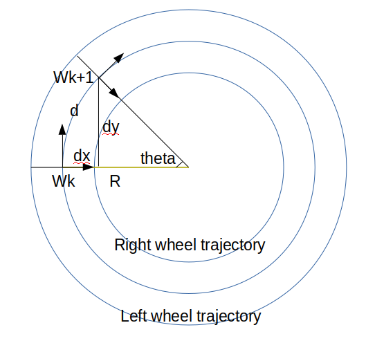

[TOC]
# Wheel Integration Factor推导
## Wheel Integration递推公式推导
### 使用相邻时刻的轮速观测计算相对位姿
如果相邻时刻的左右轮速分别为$v_{kl}, v_{kr}$和$v_{(k+1)l}, v_{(k+1)r}$，并且使用中值积分，那么相对位姿推导如下所示:
$$
\begin{aligned}
d_l 
&= 0.5(v_{kl} + v_{(k+1)l})\delta{t} 
(左后轮行驶距离) \\
d_r 
&= 0.5(v_{kr} + v_{(k+1)r})\delta{t} 
(右后轮行驶距离) \\
\delta{d} 
&= 0.5(d_l + d_r) 
(后轮中心行驶距离)\\
\delta{\theta}
&= \frac{(d_l - d_r)}{wal} 
(wal: wheel axle length车轴长度)\\
R
&= \frac{\delta{d}}{\delta{\theta}}
(后轮中心对应的转弯半径)\\
dx
&= Rsin(\delta{\theta}) \\
&(第2时刻轮子坐标系原点在第1时刻轮子坐标系的x坐标) \\
dy
&= R(1 - cos(\delta{\theta})) \\
&(第2时刻轮子坐标系原点在第1时刻轮子坐标系的y坐标) \\
注: &\\
1. &轮子坐标系的原点是后轮中心，三轴和车身重合，具体而言xyz分别对应前右下 \\
2. &由于假设了相邻时刻观测是平面轮动，所以相对位姿是3dof(x, y, yaw) \\
\end{aligned}
$$
上述推导涉及的符号如下图所示: 

### 使用相邻观测的相对位姿计算多个连续观测首尾观测的相对位姿
如果从首个观测积分到上述第k个观测的相对位姿已知,那么从首个观测积分到第k+1个观测的相对位姿的推导如下.
$$
\begin{aligned}
\delta{x}_{w_iw_{k+1}}
&= \delta{x}_{w_iw_k} + cos(\delta{\theta}_{w_iw_k})dx - sin(\delta{\theta}_{w_iw_k})dy \\
\delta{y}_{w_iw_{k+1}}
&= \delta{y}_{w_iw_k} + sin(\delta{\theta}_{w_iw_k})dx + sin(\delta{\theta}_{w_iw_k})dy \\
\delta{\theta}_{w_iw_{k+1}} 
&= \delta{\theta}_{w_iw_k} + \delta{\theta} \\
\end{aligned}
$$
上述推导的本质是将$w_k$系下的增量dx, dy, $\delta{\theta}$先转到$w_i$系,然后再累加到截至k时刻的积分量上．此外，$\delta{\theta}_{w_iw_{k+1}}$的精确推导应该是将$\delta{\theta}_{w_iw_k}$和$\delta{\theta}$转成旋转矩阵并且相乘之后再转回成角i度．此处由于$\delta{\theta}$较小，做以上近似不会带来太大误差，同时可以简化计算.
### 总结
* 轮速积分的基本思想和imu预积分是一致的，都是将相邻两个关键帧之间的所有观测积分成一个在前一个关键帧坐标系下的增量.但是，由于imu预积分依然和ba,bg相耦合，所以需要迭代求解预积分关于ba,bg的Jacobian；轮速积分不与任何状态相耦合，所以其积分过程会比imu预积分要简单很多
* $\color{#f00}{轮速积分没有同步的将其Covariance算出来}$
## Wheel Integration Factor Residual推导
假设和轮速积分相关联的状态分别为$p_{wI_i}, q_{wI_i}, p_{wI_j}, q_{wI_j}$,轮速积分为$\delta{p_{W_iW_j}}, \delta{q_{W_iW_j}}$，W, I分别表示Wheel坐标系和Imu坐标系，则轮速积分的residual推导如下
$$
\begin{aligned}
p_{wW_i} 
&= q_{wI_i}t_{IW} + p_{wI_i} \\
q_{wW_i}
&= q_{wI_i}q_{IW} \\
p_{wW_j} 
&= q_{wI_j}t_{IW} + p_{wI_j} \\
q_{wW_j}
&= q_{wI_j}q_{IW} \\
r_p 
&= [q_{wW_i}^{*}(p_{wW_j} - p_{wW_i}) - \delta{p_{W_iW_j}}]_{xy} \\
r_q
&= 2[(q_{wW_i}^{*}q_{wW_j})^{*}\delta{q_{W_iW_j}}]_{z}   
\end{aligned}
$$
$\color{#f00}{只选取了x,y,yaw的误差，因为z向受pitch角误差较大}，这边需要一个证明$
## Wheel Integration Factor Jacobian推导 
$$
\begin{aligned}
\frac{\partial{r_p}}{\partial{X}}: \\
r_p^{'} 
&= [q_{wW_i}^{*}(p_{wW_j} - p_{wW_i}) - \delta{p_{W_iW_j}}] \\
\frac{\partial{r_p^{'}}}{\partial{p_{wI_i}}}
&= \frac{\partial{r_p^{'}}}{\partial{p_{wW_i}}}\frac{\partial{p_{wW_i}}}{\partial{p_{wI_i}}}\\
&= -R_{wW_i}^{T}*I\\
&= -R_{wW_i}^{T}\\
\frac{\partial{r_p^{'}}}{\partial{q_{wI_i}}}
&= R_{IW}^T[R_{wW_i}^{T}(p_{wW_j} - p_{wW_i})]_{\times}\\
&(将q_{wW_i}先在r_p^{'}中展成q_{wI_i}q_{IW})\\
\frac{\partial{r_p^{'}}}{\partial{p_{wI_j}}}
&= \frac{\partial{r_p^{'}}}{\partial{p_{wW_j}}}\frac{\partial{p_{wW_j}}}{\partial{p_{wI_j}}}\\
&= R_{wW_i}^{T}*I\\
&= R_{wW_i}^{T}\\
\frac{\partial{r_p^{'}}}{\partial{q_{wI_i}}}
&= 0\\
\frac{\partial{r_p^{'}}}{\partial{t_{IW}}}
&= \frac{\partial{r_p^{'}}}{\partial{p_{wW_j}}}\frac{\partial{p_{wW_j}}}{\partial{t_{IW}}} + \frac{\partial{r_p^{'}}}{\partial{p_{wW_i}}}\frac{\partial{p_{wW_i}}}{\partial{t_{IW}}} \\
&= R_{wW_i}^{T}R_{wI_j} - R_{wW_i}^{T}R_{wI_i}\\
\frac{\partial{r_p^{'}}}{\partial{q_{IW}}}
&= [R_{IW}^{T}R_{wW_i}^{T}(p_{wW_j} - p_{wW_i})]_{\times} 
\\
&(将q_{wW_i}先在r_p^{'}中展成q_{wI_i}q_{IW}; 扰动变化发生在I上)\\
\frac{\partial{r_q}}{\partial{X}}: \\
r_q'
&= 2[(q_{wW_i}^{*}q_{wW_j})^{*}\delta{q_{W_iW_j}}]_{xyz} \\
\frac{\partial{r_q}^{'}}{\partial{p_{wI_i}}} 
&= 0 \\ 
\frac{\partial{r_q}^{'}}{\partial{q_{wI_i}}} 
&= [[q_{IW}\delta{q_{W_iW_j}}]_R[q_{wW_j}^{*}q_{wI_i}]_L]_{br33} \\ 
\frac{\partial{r_q}^{'}}{\partial{p_{wI_j}}} 
&= 0 \\ 
\frac{\partial{r_q}^{'}}{\partial{q_{wI_i}}} 
&= [[q_{wI_j}^{*}q_{wW_i}\delta{q_{W_iW_j}}]_R[q_{IW}^{*}]_L]_{br33} \\ 
\frac{\partial{r_q}^{'}}{\partial{t_{IW}}} 
&= 0 \\ 
\frac{\partial{r_q}^{'}}{\partial{q_{IW}}} 
&= \color{#f00}{TODO} \\ 
\end{aligned}
$$